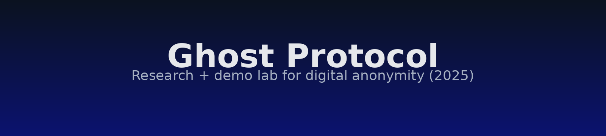

---

# 🕵️‍♂️ Ghost-Protocol

<p align="center">
  
</p>

<p align="center">
  <a href="LICENSE"></a>
  
  
  <a href="https://www.torproject.org/"></a>
  <a href="CONTRIBUTING.md"></a>
</p>

**A tiny lab that makes anonymity feel obvious.**
Paste one line, watch a hardened Tor-Firefox open, and see a live sidecar verify: **Tor OK, HTTPS-only enforced, WebRTC/DNS not leaking**.

---

## 🎬 Demo

<p align="center">
  
</p>

> **What you’ll see (20s):** copy the one-liner → Tor-hardened Firefox launches → Ghost Shield sidecar opens → visit Tor Check + an HTTP-only test → sidecar shows Tor exit IP, HTTPS-only blocking, and DNS differs (no local leak).

---

## ⚡ One-liner (Linux, Firefox)

```bash
bash -c 'set -e; cd ~; REPO=ghost-protocol; [ -d "$REPO" ] || git clone https://github.com/Giuseppe552/ghost-protocol.git "$REPO"; cd "$REPO"; git pull --rebase || true; python3 -m pip install --user -r requirements.txt >/dev/null 2>&1 || true; python3 -c "import tkinter" 2>/dev/null || (sudo apt-get update -y && sudo apt-get install -y python3-tk); mkdir -p ~/.mozilla/firefox/ghostshield; grep -q "network.trr.mode" ~/.mozilla/firefox/ghostshield/user.js 2>/dev/null || printf "\nuser_pref(\"network.trr.mode\", 5);\n" >> ~/.mozilla/firefox/ghostshield/user.js; GP_ASSUME_YES=1 python3 tools/ghost_browser_secure.py >/dev/null 2>&1 & sleep 5; python3 tools/ghost_sidecar.py'
```

---

## 🧭 What’s in the repo (short)

* **Ghost Shield (sidecar):** live Tor/DNS/WebRTC status + quick test links.
* **Hardened browser launcher:** spins up a separate Firefox profile with HTTPS-Only & anti-WebRTC defaults for Tor use.
* **Leak tests:** small Python scripts that check exit IP, Tor status, and DNS differences.
* **Metadata cleaner:** remove metadata from JPG/PDF/DOCX.

---

## ✅ Ethics & intent

Ghost-Protocol is for **education and defense**: teaching how leaks happen and how to avoid them. Don’t use it to harm people or break the law.

---

## 🔎 SEO-friendly FAQ

**Q: Is Tor Browser enough for anonymity?**
A: Tor hides your IP, but sites/OS settings can still leak info (e.g., WebRTC, DNS, plugins). This project shows how to **verify** you’re actually safe.

**Q: What’s a DNS leak and why does “DNS differs” matter?**
A: If your DNS goes to your ISP instead of through Tor, websites can correlate you. “DNS differs via Tor” means lookups **aren’t** using your local resolver.

**Q: How does HTTPS-Only help anonymity?**
A: It blocks plaintext HTTP so intermediaries can’t see/alter requests. With Tor, this reduces metadata exposure and downgrade attacks.

**Q: Does WebRTC leak my real IP?**
A: It can. The sidecar includes a WebRTC test page to confirm **no local IPs** are exposed.

**Q: Can I run this on Windows/Mac?**
A: Linux-first today. Some tools may work cross-platform, but the hardened launcher and sidecar are targeted at Linux.

---

## 📄 License

MIT — see [LICENSE](LICENSE).

---

## 📬 Contact

Questions, ideas, hiring? **[contact.giuseppe00@gmail.com](mailto:contact.giuseppe00@gmail.com)**

---


