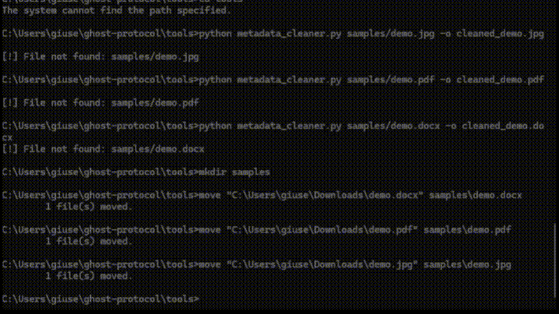

## 🛡️ Tools

### 1. VPN Leak Test (`vpn_leak_test.py`)

This script performs an **advanced VPN privacy audit** and generates a structured JSON report.  
It is designed to show **where VPNs leak identifying information** — useful for privacy researchers, penetration testers, and security-conscious users.

🔍 It tests for:

- 🌐 **DNS Leaks** – Detects if your system is leaking real DNS servers.
- 🎥 **WebRTC Leaks** – Checks if your local IP is exposed via STUN (common in browsers).
- 🔢 **IPv6 Leaks** – Confirms whether IPv6 traffic escapes the VPN tunnel.
- 📍 **Geolocation Leaks** – Compares VPN IP-based location with system location.

---

#### ⚙️ Usage

```bash
cd tools
python vpn_leak_test.py
````

This creates a report:

```
vpn_leak_report.json
```

---

#### 📝 Example Output

```json
{
  "dns_leak": false,
  "webrtc_leak": true,
  "ipv6_leak": false,
  "geolocation": {
    "ip": "185.199.108.153",
    "country": "Germany",
    "city": "Frankfurt"
  }
}
```

---

#### 🎯 Why This Matters

Most VPN services advertise "no leaks," but real-world setups often fail.
This tool demonstrates:

* How **DNS misconfigurations** expose browsing history.
* Why **WebRTC** is a silent leak vector in most browsers.
* How **IPv6** bypasses legacy VPN tunnels.
* Why **location mismatches** show when your VPN isn’t fully private.

By showing JSON output, this tool can also be integrated into dashboards, reports, or automated red-team pipelines.

---

💡 **Educational Purpose Only**
This tool is part of the Ghost Protocol project, which demonstrates **how anonymity leaks occur** — so that better privacy systems can be designed.


---

### 2. Metadata Cleaner (`metadata_cleaner.py`)

This tool removes **hidden metadata** from files before sharing.
Metadata often leaks **who created a file, when, where, and with what device/software** — a critical privacy risk.

📂 Supported file types:

* 🖼️ **Images** – Strips EXIF tags (camera model, GPS location, date).
* 📑 **PDFs** – Removes embedded author, creation date, and software info.
* 📝 **DOCX (Word docs)** – Cleans document properties (author, comments, revision history).

---

#### ⚙️ Usage

```bash
cd tools

# Clean an image
python metadata_cleaner.py samples/demo.jpg -o cleaned_demo.jpg

# Clean a PDF
python metadata_cleaner.py samples/demo.pdf -o cleaned_demo.pdf

# Clean a DOCX
python metadata_cleaner.py samples/demo.docx -o cleaned_demo.docx
```

This will output cleaned versions of your files with metadata removed.

---

#### 📝 Example Demo

Here’s the tool in action (recorded as a GIF):



---

#### 🎯 Why This Matters

* 📸 **Photos** – GPS coordinates in a selfie can reveal your home address.
* 📄 **Business Docs** – Author tags can leak employee names or internal systems.
* ⚖️ **Legal/Evidence** – Metadata leaks can compromise sensitive investigations.

This script shows **how easy it is to sanitize files** before uploading or sending.
In corporate or government settings, this prevents **accidental leaks of sensitive data**.

---

💡 **Educational Purpose Only**
This tool demonstrates how **metadata leaks identity**. It’s included in Ghost Protocol to show practical steps toward reducing digital footprints.

---

